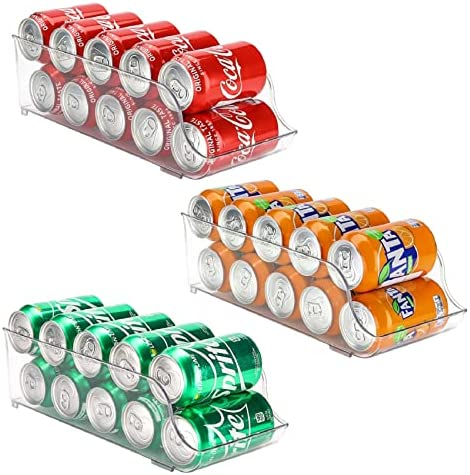

# Assignment 3 - Canned Food and Drinks Inventory System

This assignment is a bit more complex, and you should:
- carefully analyze the requirements
- plan how to structure and implement the system
- after completing the implementation give a brief writeup of the system you've implemented.

## Requirements
A warehouse is designed to store canned food and drinks in standard bins. 
For the simplicity, let's assume that all the cans are of the same size. Also, by canned food we'll assume both food and drinks.



You are tasked to design a Canned Food and Drinks Inventory System to support the operation.

### Bin
Each bin can store up to 10 canned foods.

Each bin only stores the same type of canned food.

All the bin stores different type of canned food.

In the warehouse there are exactly 10 bins available. Each bin has a unique identifier, 
represented by the number `1 - 10`.

### Can
Canned Food have next attributes:
- `id` (Integer, a unique identifier)
- `type` (String)
- `expiry date` (LocalDate, in the ISO format yyyy-MM-dd, e.g. 2022-04-30)

`type` uniquely defines the variety of the product and its brand. For example:
- Soft_drink_Cola
- Soft_drink_Fanta
- Sardine_Eva
- Sardine_Spain
- Soup_Takovo
- Beans_Tetovo
- etc.

### CannedFoodWarehouse

The Warehouse contains the collection of bins. 

The data should be stored in a CSV file. You should load the file at the program start and update the file
after the changes are done and user exists the application. The base file is [canned_food.csv](canned_food.csv).

The application's `main` method should first load the existing data from the CSV file and afterward accept the textual input by which the user can select different options 
and provide needed data. Options should be:

```
1 - List all bins
2 - List a single bin
3 - Add food
4 - Remove food
5 - Remove all expired food
0 - Save and Exit
```

Below is the description for each of the functionalities.

#### 1 - List all bins 
Print in a table for all the bins: 
- bin location
- the type of food stored in a bean
- the number of cans in a bin
- the minimum expiry date of all the canned food items in that bean

Example:
```
Bin No. | Type               | No. Items | Min. Expiry Date 
1       | Soft_drink_Cola    | 4         | 2022-04-29
2       | Sardine_Spain      | 10        | 2025-12-29
3       | Beans_Tetovo       | 8         | 2022-01-01
```

#### 2 - List a single bin
- The user should provide the bin identifier.
- If the specified bin contains canned food, list all the items in that bin with their expiry dates

Example:
```
Canned Food ID  | Type               | Expiry Date 
1               | Soft_drink_Cola    | 2022-10-15
2               | Soft_drink_Cola    | 2025-10-15
3               | Soft_drink_Cola    | 2022-04-29
```

#### 3 - Add food
- The user should provide the canned food id, type and an expiry date
- Search for the bin that store this type of canned food:
    - if found, store the provided canned food into that bin
    - if not found, search for the available empty bin and store the provided canned food there
- If not possible to store the given canned food, print the error message

#### 4 - Remove food
- The user provides the canned food id
- Remove the canned food from the bin

#### 5 - Remove all expired food
- Find all the canned food items, in any bin, which expiry date has passed
- Remove the found canned food items

#### 0 - Save and Exit
- Save the data into the CSV file
- Exit the application

#### Important

You need to handle all possible errors that will occur during the program execution, for example:
- No canned food found
- Bin is full
- Invalid date entered by the user
- No available bin to store the canned food.


